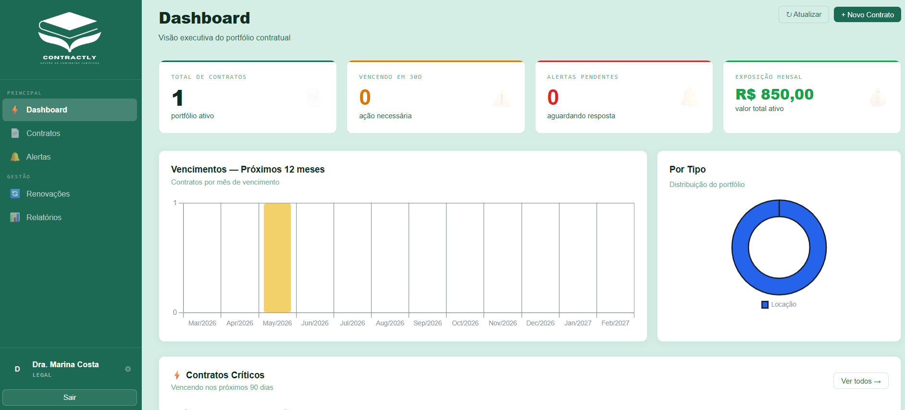

<p align="center">
  
</p>


# Contractly
### Gestão de Contratos Jurídicos

**Plataforma web para gestão do portfólio contratual de escritórios de advocacia e departamentos jurídicos corporativos.**  
Controle prazos, receba alertas automáticos e mantenha um histórico auditável de todas as decisões contratuais.


</div>

---

## 📸 Telas do Sistema


<br/>

**🔐 Dashboard**



<br/>

**📊 Dashboard**
<!--  -->

<br/>

**📄 Gestão de Contratos**
<!--  -->

<br/>

**🔔 Painel de Alertas**
<!--  -->

<br/>

**📝 Cadastro de Contrato**
<!--  -->

---

## 💡 O que é o Contractly?

O Contractly é um sistema de gestão de contratos desenvolvido para eliminar o risco de vencimentos não monitorados. Em ambientes jurídicos, perder um prazo contratual pode gerar multas, rescisões indesejadas ou prejuízos financeiros significativos.

O sistema centraliza todos os contratos em um único painel, automatiza os alertas de vencimento e garante que o responsável seja notificado no momento certo — sem depender de planilhas, lembretes manuais ou memória.

---

## 🎯 Para quem é este sistema?

| Público | Necessidade atendida |
|---|---|
| ⚖️ **Escritórios de advocacia** | Gestão de contratos de clientes e contratos internos do escritório |
| 🏢 **Departamentos jurídicos corporativos** | Portfólios de contratos de fornecedores, locação, serviços e parcerias |
| 👔 **Gestores** | Visibilidade sobre prazos e valores sem depender da equipe jurídica para cada consulta |

---

## ✨ Funcionalidades

### 📊 Dashboard Executivo
Visão consolidada do portfólio em tempo real. Ao fazer login, o usuário visualiza imediatamente quantos contratos estão ativos, quantos estão próximos do vencimento, quantos já venceram e o valor total e mensal sob gestão. Os contratos mais críticos são listados diretamente na tela inicial.

### 📄 Gestão de Contratos
Cadastro completo de contratos com todos os dados relevantes: partes, tipo, datas, valores, responsável interno, departamento e observações. É possível marcar contratos como confidenciais, limitando o acesso apenas ao responsável e ao administrador. A listagem permite busca por título, contraparte ou código, com filtros por status e tipo.

### 🔔 Alertas Personalizados
Cada contrato possui um prazo de alerta configurável pelo próprio usuário no momento do cadastro. O usuário define com quantos dias de antecedência deseja ser notificado — por exemplo, 45 dias antes do vencimento. O sistema cria **1 alerta por contrato**, dispara uma notificação no painel e envia um e-mail automático ao responsável quando o prazo chega. Não há alertas desnecessários: apenas o aviso configurado, no momento certo.

### 🔄 Gestão de Renovações
Toda decisão sobre um contrato vencendo — renovar, encerrar ou aguardar — é registrada no sistema. Isso cria um histórico auditável completo. Ao renovar, o sistema atualiza automaticamente as datas do contrato e recria o alerta para o novo período, sem necessidade de reconfiguração.

### 👥 Controle de Acesso por Perfil
O sistema possui quatro perfis de acesso com permissões distintas: Administrador, Jurídico, Gestor e Visualizador. Cada usuário vê e pode fazer apenas o que seu perfil permite, garantindo segurança e integridade das informações.

### 📈 Relatórios
Relatórios prontos para reuniões e auditorias: vencimentos próximos (30, 60 e 90 dias), portfólio completo, histórico de alertas e visão financeira por tipo e departamento. Todos os relatórios podem ser exportados em PDF diretamente pelo sistema.

### 🔍 Auditoria
Registro automático de todas as ações realizadas no sistema: criação, edição e exclusão de contratos, alterações de usuários e reconhecimento de alertas. Acessível apenas pelo perfil Administrador.

---

## 🔁 Como funciona — Workflow principal

```
┌─────────────────────────────────────────────────────────────┐
│                    CICLO DE VIDA DO CONTRATO                │
└─────────────────────────────────────────────────────────────┘

  📝 1. CADASTRO
     └── Usuário informa os dados e define o prazo de alerta
         Ex: "Alertar 45 dias antes do vencimento"

         ↓

  🗓️  2. AGENDAMENTO
     └── Sistema cria 1 alerta agendado para a data calculada
         Ex: vencimento em 01/06 → alerta agendado para 17/04

         ↓

  🔍 3. MONITORAMENTO AUTOMÁTICO
     └── A cada hora, o sistema verifica todos os contratos
     └── Quando o prazo chega, o alerta aparece no painel

         ↓

  📧 4. NOTIFICAÇÃO
     └── E-mail enviado automaticamente ao responsável
     └── Alerta visível no painel com prioridade calculada

         ↓

  ✅ 5. AÇÃO E RECONHECIMENTO
     └── Responsável toma a ação necessária
         (renovar, contatar a contraparte, encerrar, etc.)
     └── Clica em "Resolver" — alerta sai da fila ativa

         ↓

  📁 6. DECISÃO REGISTRADA
     └── Renovação ou encerramento registrado com histórico
     └── Se renovado: novo alerta criado automaticamente
         para o próximo período de vigência
```

---

## 🚦 Status dos Contratos

| Status | Quando ocorre | Ação recomendada |
|---|---|---|
| 🟢 **Ativo** | Vigente, sem alertas críticos | Monitorar normalmente |
| 🟡 **Vencendo** | Menos de 30 dias para vencer | Iniciar processo de renovação |
| 🔴 **Vencido** | Data de vencimento ultrapassada | Regularizar urgentemente |
| ⚫ **Cancelado** | Encerrado manualmente | Nenhuma |

---

## 👤 Perfis de Acesso

| Perfil | Permissões |
|---|---|
| 🔑 **Admin** | Acesso total: contratos, usuários, auditoria, confidenciais |
| ⚖️ **Jurídico** | Criar e editar contratos, ver todos os alertas, registrar renovações |
| 👔 **Gestor** | Visualizar contratos e alertas do seu departamento |
| 👁️ **Viewer** | Somente visualização dos contratos permitidos |

---

## 📌 Por que o Contractly é útil para o negócio jurídico?

> **⚠️ Redução de risco operacional**  
> Prazos contratuais perdidos geram multas, renovações automáticas indesejadas e exposição legal. O sistema elimina esse risco com alertas automáticos configurados por contrato.

> **💰 Visibilidade financeira**  
> O dashboard consolida o valor total e mensal de todos os contratos ativos, permitindo decisões informadas sobre renovações e cortes de custo.

> **📋 Rastreabilidade e conformidade**  
> Todo o ciclo de vida de um contrato — cadastro, alertas, renovações, encerramentos — fica registrado com data, hora e usuário responsável, atendendo requisitos de auditoria interna e externa.

> **🔒 Trabalho colaborativo com segurança**  
> Múltiplos usuários acessam o sistema com permissões adequadas ao seu papel, sem risco de alterações indevidas ou acesso a informações confidenciais.

> **📂 Menos dependência de planilhas**  
> Centraliza em um único lugar informações que normalmente ficam espalhadas em planilhas Excel, pastas de e-mail e agendas pessoais.

---

## 🛠️ Tecnologias


| Camada | Stack |
|---|---|
| **Backend** | Python · Flask |
| **Frontend** | HTML · CSS · JavaScript |
| **Banco de dados** | PostgreSQL |
| **Hospedagem** | Render |
| **Agendamento de alertas** | APScheduler |
| **Exportação PDF** | jsPDF |

---

<div align="center">

**Contractly — Gestão de Contratos Jurídicos**  
*Nunca mais perca um prazo contratual.*

</div>
